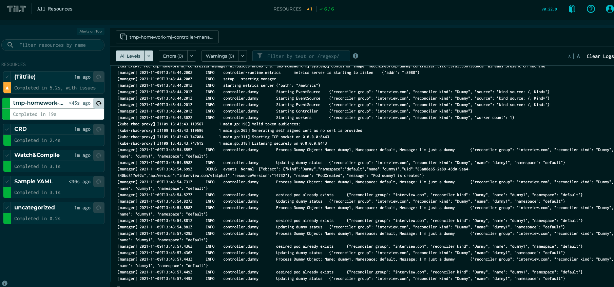

## SOLUTION

### Step 2: done

### Step 3: done

### Step 4: done

### Step 5: done

### Extra features

- `dummy-controller` publish k8s events

- `tilt` integration for local development

#### TEST

In order to test dummy controller, you have 2 options:

##### Using [tilt](https://tilt.dev) 

You can use tilt to deploy dummy controller along with it's CRD/Sample resource.

With tilt you're ensuring fast feedback loop (When you change something, tilt will update the controller/CRD/Sample resource inside the running cluster).

If you prefer to use tilt.

Then, Just
```
tilt up
```

**Note** Hit space in order to open tilt ui.




To destroy everything:

```
tilt down
```
##### Manually

To run everything manually:

- First of all, you need to install the CRD 

```
make install
```

- Then, you need to deploy dummy controller

```
 make deploy IMG=medchiheb/tmp-dummy-controller:v1.0.0-alpha1
```

**Note**: controller is deployed to namespace: `p-homework-mj-system`

- Finally, you can install the Sample resource

```
make sample
```


To cleanup:

```
make cleanup
```


